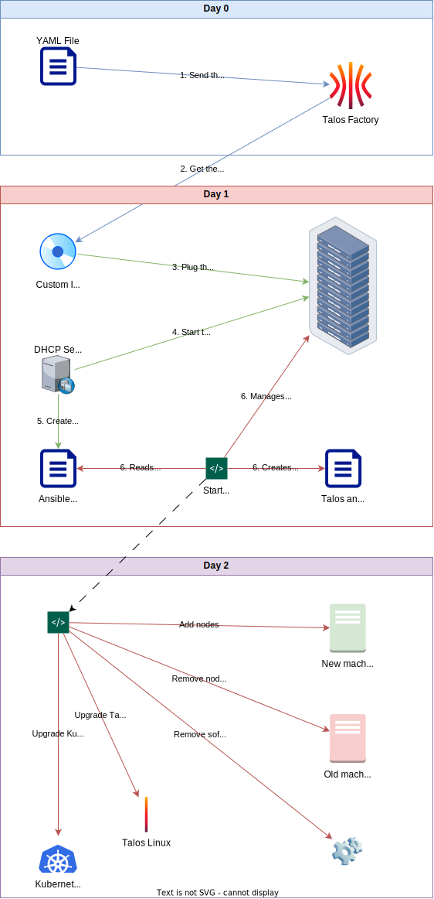

# Day-0 operations

## Architecture


## Workflow



## Create the ISO image

Depending on your needs, you might customise the ISO image used to start and install the nodes.
The current YAML file adds gVisor and ZFS support.

1. Edit `base-metal.yaml` to add custom options to the ISO image.
2. Create the right ISO image using the Talos Factory

```console
$  make metal-amd64.iso # Create the amd64 ISO image
$  make metal-arm64.iso # Create the arm64 ISO image
```
