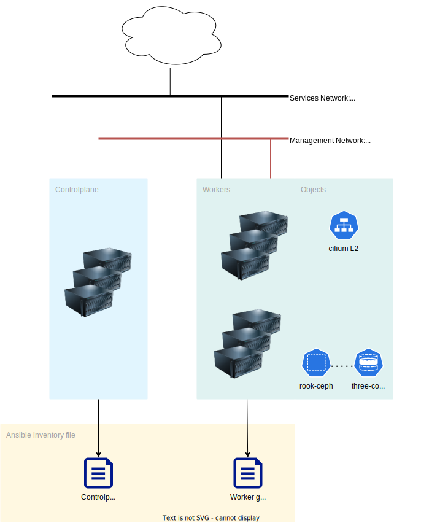

# Day-0 operations

## Architecture

Each node has two network interfaces:

- The first one: used for management, using DHCP get get an address.
- The second one: ured for publshing services, using static addresses.



In case of other designs, you should edit the patches applied by Talos during the installation phase using `machine_patch`:

```yaml
# group_vars/all.yml
---

machine_patch:
  machine: {} # Add the attibutes you need
```

The ansible group files are there:

```
/
├── LICENSE
├── README.md
├── day-0
├── group_vars
│   ├── all.yml          # All machines
│   ├── controlplane.yml # Controlplane
│   └── worker.yml       # Worker
└─── inventory.ini
```

## Workflow


## Create the ISO image

Depending on your needs, you might customise the ISO image used to start and install the nodes.
The current YAML file adds gVisor support.

1. Edit `bare-metal.yaml` to add custom options to the ISO image.
1. Create the right ISO image using the Talos Factory

For example:

```yaml
# day-0/bare-metal.yaml
---
customization:
  systemExtensions:
    officialExtensions:
    - siderolabs/gvisor
```

Then run the targets:

```console
$  make metal-amd64.iso # Create the amd64 ISO image
$  make metal-arm64.iso # Create the arm64 ISO image
```

## Configure the required variables

### Cluster name and Cilium version

You must set a name to the cluster and set the cilium version to install. These attributes are present in `all.yaml`.

```yaml
# group_vars/controlplane.yml
---

generic_machineconfig: controlplane.yaml # Used by talosctl

cilium:
  version: "1.15.1" # Value to be set
```

```yaml
# group_vars/all.yml
---

cluster_name: my-cluster # Value to be set
```

### Ceph storage and disks

The disks should be declared properly, the given spec should be patched.

```yaml
# day-1/manifests/rook.cluster.yaml
---
spec:
  storage:
    useAllNodes: true
    useAllDevices: false
    deviceFilter: "^vdb" # You should update the filter
```

## Configure the optional variables

### Cilium L2 LoadBalancer

Cilium will used L2 announcements to publish service, such as Ceph or Hubble WebGUI. The documentation about [LB IPAM](https://docs.cilium.io/en/stable/network/lb-ipam/) might be useful. Moreover, [the documentation about L2 explains how to size the client rate limit](https://docs.cilium.io/en/latest/network/l2-announcements/#sizing-client-rate-limit).

```yaml
# group_vars/controlplane.yml
---

cilium:
  version: "1.15.1"
  hubble_ui_emdpoint_cidr: "192.168.70.131" # This address is part of cilium.l2.blocks
  l2:
    blocks: # Let’s declare 6 IP addresses
    - cidr: "192.168.70.128/25"
    announcements:
      lease:
        duration: 3s        # Tuning needed
        renew_deadline: 1s  # Tuning needed
        retry_period: 500ms # Tuning needed
  k8s_client_rate_limit:
    qps: 2   # Tuning needed
    burst: 5 # Tuning needed

ceph:
  manager_endpoint_cidr: "192.168.70.130" # This address is part of cilium.l2.blocks
```

### Tinkerbell

The tink stack LoadBalancer must use a Cilium-based IP address thanks to the pre-defined CIDR blocks.

```yaml
# group_vars/controlplane.yml
---

tinkerbell:
  lb_ip: "192.168.70.132"      # This address is part of cilium.l2.blocks
  stack_chart_version: "0.4.3" # Choose the release you want
```
